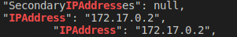
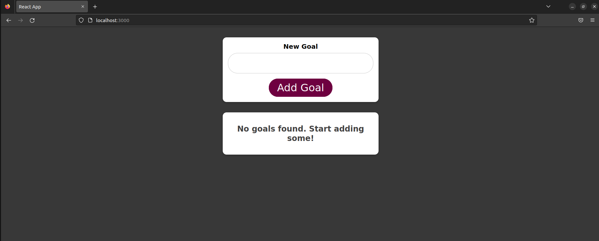
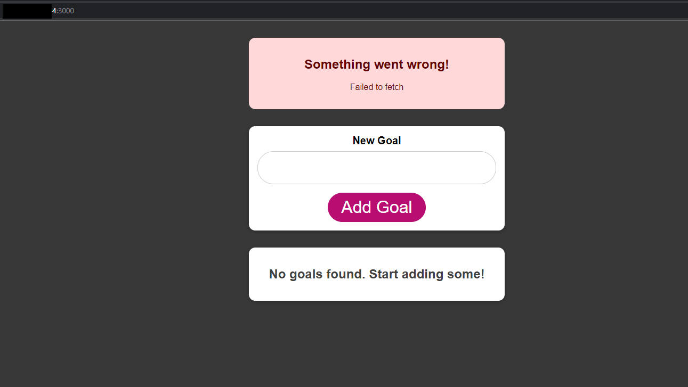

# Goals App
This is a basic multilayer app to be dockerized

---
## How to run

1. Create and run a container with the mongo db
    ```console
    docker run -d --name mongo-db --rm mongo
    ```

2. Build the image for the backend application
    ```console
    docker build -t goals-js-backend ./backend
    ```

3. Look for the db IP address
    ```console
    docker inspect mongo-db | grep -e IPAddress
    ```
    you should get an output similar to the following:
    
    
    
    Copy the __IPAddress__

4. Run the backend application

    Use the container __IPAddress__ copied in the previous step instead of `{mongo-db-address}` in the following command:

    ```console
    docker run -d -p 80:80 -e APP_PORT=80 -e MONGO_DATASOURCE_URL=mongodb://{mongo-db-address}:27017/course-goals --name goals-backend --rm goals-js-backend
    ```

5. Build the image for frontend
    ```console
    docker build -t goals-js-frontend ./frontend
    ```

6. Run the frontend 
    ```console
    docker run -d -p 3000:3000 --rm --name goals-frontend goals-js-frontend
    ```
    
    :warning: Note that the react application for the frontend run on the browser, so in this case localhost refers to the host machine instead of the application container 

7. Now, you can visit your __localhost:3000__


    :triangular_flag_on_post: As mentioned in the previous step the application runs in the browser and tries to communicate with the backend on the browser's local host. In this case if you try to access from another machine you will get an error because the backend is on the localhost where the container is running.


